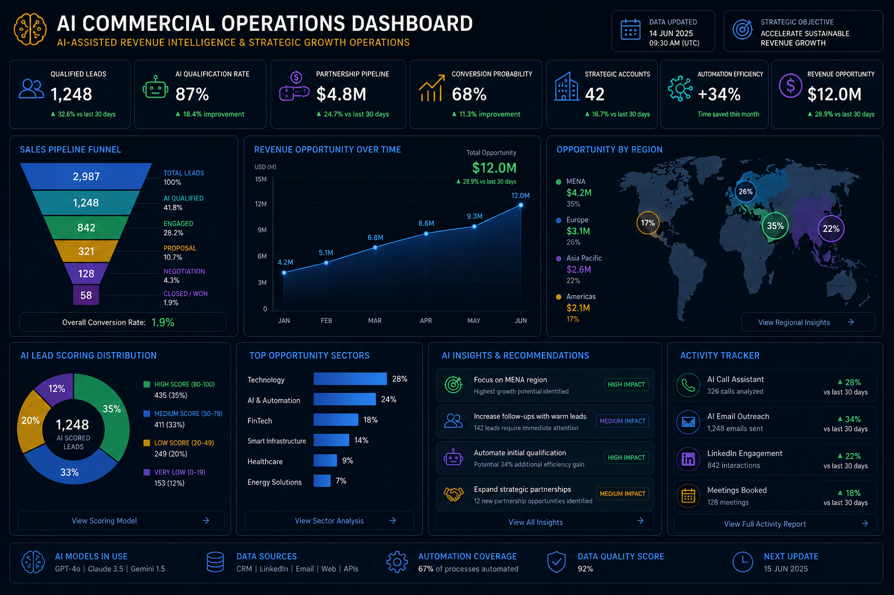
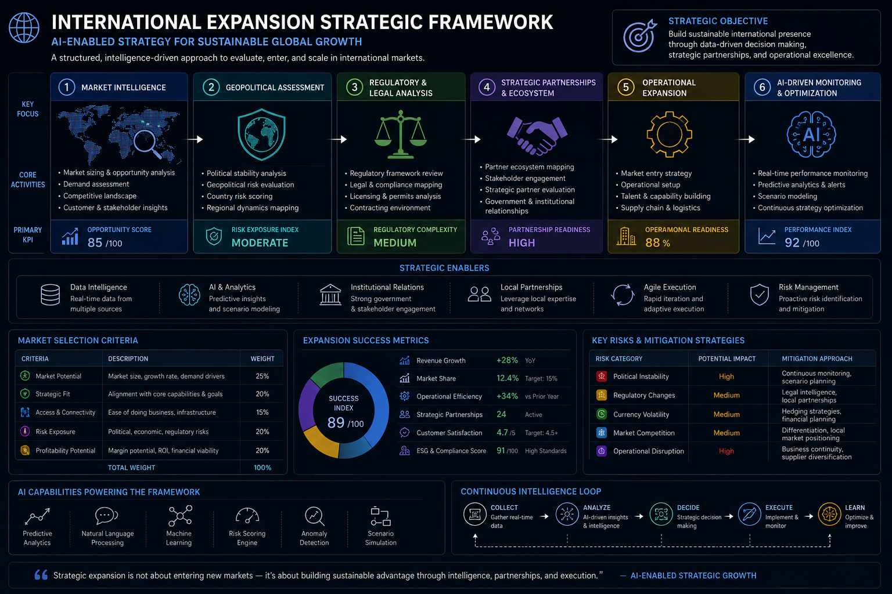

# AI Business Development Toolkit

### AI-Assisted Commercial Intelligence | Business Development | GTM | Strategic Partnerships | International Expansion

A practical portfolio of AI-assisted tools, strategic frameworks and commercial intelligence systems designed to support Business Development, Go-to-Market execution, strategic partnerships and international market expansion.

This repository serves as the central hub connecting a growing ecosystem of applications and frameworks focused on practical commercial decision-making.

The objective is not to build technology for technology's sake.

The objective is to use AI, structured data and commercial strategy to answer practical business questions:

* Which opportunities deserve attention?
* Where should commercial resources be allocated?
* How should organizations approach and develop opportunities?
* Which partners offer the strongest strategic fit?
* Which markets should organizations enter?
* What should the next commercial action be?

---

## Commercial Intelligence Lifecycle

The portfolio is structured around five stages of the Business Development and international growth lifecycle:

### Identify → Prioritize → Engage → Partner → Expand

| Stage          | System                    | Commercial Purpose                                           |
| -------------- | ------------------------- | ------------------------------------------------------------ |
| **Identify**   | Lead Intelligence         | Identify commercially relevant accounts and opportunities    |
| **Prioritize** | Revenue Prioritization    | Determine where commercial resources should be allocated     |
| **Engage**     | Outreach Intelligence     | Structure outreach, follow-up and opportunity development    |
| **Partner**    | Partnership Intelligence  | Identify and evaluate strategic partners and ecosystems      |
| **Expand**     | Market Entry Intelligence | Evaluate and structure international expansion opportunities |

Together, these systems form an evolving AI-assisted Commercial Intelligence ecosystem.

---

## Featured Applications

### 🎯 Lead Qualification & Revenue Prioritization

**Role in the ecosystem:** `Identify → Prioritize`

AI-assisted commercial intelligence platform designed to help Business Development teams identify which accounts and opportunities deserve immediate attention.

#### Core Capabilities

* Lead Scoring
* Tier Classification
* Revenue Prioritization
* Executive Account Dashboard
* Lead Intelligence Workspace
* AI Account Intelligence
* AI Outreach Generation
* GTM Recommendations

#### Business Problem

Commercial teams frequently have more opportunities than they can effectively pursue.

This application helps structure prioritization so resources can be focused on higher-potential accounts and opportunities.

#### Live Application

[Launch Lead Qualification & Revenue Prioritization](https://lead-qualification-scorer-eambrosin.streamlit.app/)

#### Repository

[View lead-qualification-scorer](https://github.com/Eambrosin/lead-qualification-scorer)

---

### ✉️ Outreach Intelligence

**Role in the ecosystem:** `Engage`

AI-assisted outreach and follow-up platform designed to support structured commercial engagement and improve Business Development execution.

#### Core Capabilities

* Executive Outreach Dashboard
* Follow-Up Prioritization
* Business Development Intelligence
* AI Outreach Generation
* Revenue Risk Analysis
* Commercial Opportunity Assessment
* Multi-Step Follow-Up Sequences

#### Business Problem

Strong opportunities can be lost through inconsistent outreach, poor prioritization or weak follow-up discipline.

The application combines commercial intelligence with AI-assisted communication to help teams structure account engagement.

#### Live Application

[Launch Outreach Intelligence](https://outreach-sequence-generator-7dcmglcxfnmszlodg8lqre.streamlit.app/)

#### Repository

[View outreach-sequence-generator](https://github.com/Eambrosin/outreach-sequence-generator)

---

### 🤝 Partnership Opportunity Finder

**Role in the ecosystem:** `Partner`

AI-assisted platform for identifying, evaluating and prioritizing strategic partnership opportunities.

#### Core Capabilities

* Partnership Fit Scoring
* Executive Partnership Dashboard
* Opportunity Heatmap
* Regional Expansion Dashboard
* Partner Portfolio Analysis
* Executive Recommendation Center
* AI Partnership Insights
* Partnership Intelligence Workspace

#### Business Problem

Organizations evaluating multiple potential partners often lack a consistent methodology for comparing strategic fit, commercial potential and expansion relevance.

This system provides a structured framework for partnership prioritization and strategic decision-making.

#### Live Application

[Launch Partnership Opportunity Finder](https://partnership-opportunity-finder-eambrosin.streamlit.app/)

#### Repository

[View partnership-opportunity-finder](https://github.com/Eambrosin/partnership-opportunity-finder)

---

## 🌍 In Development

### Global Market Entry Intelligence

**Role in the ecosystem:** `Expand`

A decision-support system designed to help organizations evaluate international expansion opportunities and structure market-entry strategy.

The project will combine commercial, strategic, regulatory and operational factors into a structured international expansion framework.

#### Planned Capabilities

* Market Attractiveness Assessment
* Commercial Readiness Analysis
* Market Entry Barrier Mapping
* Partner Dependency Assessment
* Channel Strategy Analysis
* Localization Requirements
* GTM Strategy Recommendations
* Expansion Risk Analysis
* Market Prioritization
* 90-Day Market Entry Action Plan

#### Core Business Question

**Where should an organization expand next, and what commercial strategy should it use to enter that market?**

Initial use cases will focus on cross-border commercial analysis involving Europe, Brazil, LATAM and MENA.

---

## Strategic Frameworks & Playbooks

Technology alone does not create effective Business Development execution.

The ecosystem is supported by strategic frameworks covering areas such as:

* Lead Qualification
* Account Prioritization
* GTM Planning
* Partnership Development
* International Market Entry
* Commercial Opportunity Assessment
* Revenue Operations
* Cross-Border Business Development

Supporting frameworks are maintained in:

[View BD Frameworks & Playbooks](https://github.com/Eambrosin/bd-frameworks-and-playbooks)

---

## Commercial Intelligence Architecture

The broader portfolio is designed around a simple principle:

### Data → Intelligence → Prioritization → Action

Raw commercial information only becomes valuable when it supports a decision.

The systems in this portfolio are therefore designed to move from information toward actionable commercial recommendations.

### Data

Accounts, opportunities, markets, partners and commercial variables.

### Intelligence

Structured assessment of opportunity quality, fit, risk and strategic relevance.

### Prioritization

Determination of where time, capital and commercial resources should be allocated.

### Action

Outreach, partnership development, GTM execution or market-entry decisions.

---

## Strategic Focus Areas

The portfolio currently focuses on:

* International Business Development
* Strategic Partnerships
* Go-to-Market Strategy
* Revenue Operations
* Commercial Intelligence
* International Market Expansion
* Market Entry Strategy
* Sales Prioritization
* Partnership Ecosystem Development
* AI-Assisted Commercial Decision-Making
* AI Workflow Automation

---

## International Expansion Intelligence

Cross-border growth requires more than market-size analysis.

Commercial expansion decisions may involve:

* Market attractiveness
* Customer demand
* Competitive positioning
* Channel availability
* Partnership ecosystems
* Regulatory requirements
* Institutional considerations
* Localization requirements
* Geopolitical exposure
* Operational feasibility

These factors will increasingly be integrated into the Market Entry Intelligence layer of the portfolio.

Geopolitical and regulatory analysis are treated as supporting dimensions of international commercial strategy rather than standalone objectives.

---

## Executive Intelligence Prototypes

The following visual prototypes explore how complex commercial and international expansion information can be translated into executive decision-support interfaces.

### Global Expansion Intelligence Dashboard

**Type:** Strategic Concept Dashboard

A conceptual executive dashboard focused on international market prioritization, geopolitical context, strategic partnerships and commercial expansion opportunities.

---

### AI Commercial Operations Dashboard

**Type:** Commercial Intelligence Prototype

A conceptual executive interface focused on lead qualification, commercial pipeline intelligence, revenue operations, partnership analytics and workflow automation.

---

### Geopolitical Risk Intelligence Matrix

**Type:** Strategic Analysis Prototype

A visual framework exploring how geopolitical, regulatory and institutional factors can be incorporated into international expansion analysis.

---

### International Expansion Strategic Framework

**Type:** Strategic Framework

A structured model for evaluating international expansion through market intelligence, regulatory analysis, partnerships, operational execution and continuous optimization.

---

## Technology

The current applications and prototypes use technologies including:

* Python
* Streamlit
* Pandas
* Plotly
* OpenAI API
* Data Analytics
* AI-Assisted Workflows

Technology is treated as an enabler for commercial decision-making rather than the end objective of the portfolio.

---

## Portfolio Structure

This repository acts as the strategic hub connecting the main components of the ecosystem.

### Profile

[Eduardo Ambrosin — GitHub Profile](https://github.com/Eambrosin)

### Applications

[Lead Qualification & Revenue Prioritization](https://github.com/Eambrosin/lead-qualification-scorer)

[Outreach Intelligence](https://github.com/Eambrosin/outreach-sequence-generator)

[Partnership Opportunity Finder](https://github.com/Eambrosin/partnership-opportunity-finder)

### Knowledge Base

[BD Frameworks & Playbooks](https://github.com/Eambrosin/bd-frameworks-and-playbooks)

### In Development

**Global Market Entry Intelligence**

---

## Development Roadmap

The portfolio is actively evolving from standalone applications toward a connected Commercial Intelligence ecosystem.

Current development priorities include:

* Configurable ICP and opportunity-scoring models
* Deeper revenue prioritization
* Multilingual outreach workflows
* Partnership portfolio intelligence
* International market-entry analysis
* Cross-border commercial readiness
* Integrated Commercial Intelligence dashboards

For the detailed development roadmap:

[View ROADMAP.md](ROADMAP.md)

---

## Professional Perspective

This portfolio reflects the intersection of international Business Development, commercial strategy, strategic partnerships, market expansion and AI-assisted decision-making.

The central idea is simple:

**AI should help commercial professionals make better decisions, not replace commercial judgment.**

The projects therefore focus on practical questions faced by Business Development and international growth teams:

**Where is the opportunity?**

**How valuable is it?**

**What should be prioritized?**

**How should we engage?**

**Who should we partner with?**

**Where should we expand?**

**What should we do next?**

---

## Connect

### Professional Website

🌐 [ambrosinlegaltrade.com](https://www.ambrosinlegaltrade.com/)

### LinkedIn

💼 [linkedin.com/in/eduardoambrosin](https://www.linkedin.com/in/eduardoambrosin/)

### GitHub

💻 [github.com/Eambrosin](https://github.com/Eambrosin)
